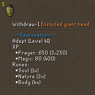
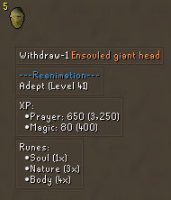
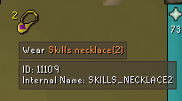

# Hover File

A Hover File is simply a JSON file with a specific structure.

For the purposes of this document, we will be working off of the [examples/ensouled_heads.json] file. 

Let's look at a truncated version of this file:

## Overall Structure
```json
{
  "is_hover_map": "absolutely",
  "hovers": [
    {
      "items_regex": [
        "ENSOULED_GOBLIN_HEAD.*"
      ],
      "hovers": [
        [
          "<col=3498db>---Reanimation---</col>",
          "Basic (Level 16)",
          "XP:",
          "  \u2022Prayer: 130 (<%qtymult(130)%>)",
          "  \u2022Magic: 32 (<%qtymult(32)%>)",
          "Runes:",
          "  \u2022Nature (2x)",
          "  \u2022Body (4x)"
        ]
      ]
    },
    ...
  ]
}
```

Every hover file, at its JSON root, must have `is_hover_map => "absolutely"`. This is just a simple header to let the plugin know that this is really a hover file. If this isn't present, the plugin won't process the file.

Next, we have an array of `hovers`. Each entry in this array is a JSON object, representing a hover.

## Individual Hover Structure

We're looking at the following hover definition (taken from the above file) for this section:

```json
{
  "items_regex": ["ENSOULED_GIANT_HEAD.*"],
  "hovers": [
    [
      "<col=3498db>---Reanimation---</col>",
      "Adept (Level 41)",
      "XP:",
      "  \u2022Prayer: 650 (<%qtymult(650)%>)",
      "  \u2022Magic: 80 (<%qtymult(80)%>)",
      "Runes:",
      "  \u2022Soul (1x)",
      "  \u2022Nature (3x)",
      "  \u2022Body (4x)"
    ]
  ]
}
```

### Targeting

First, we need to specify which items this hover applies to. We have two options: `items` or `items_regex`.

`items` is an array of strings representing the "names" (**read the note about item names below!**) of items that this hover should apply to.
If we were to use it here, it would look like:

```json
{
  "items": ["ENSOULED_GIANT_HEAD", "ENSOULED_GIANT_HEAD_13475"],
  "hovers": [...]
}
```

Note that there are two entries -- this is because, for some reason, the game has two versions of each ensouled head item. So we need to specify both of them.

`items_regex` works the same as `items`, but it is an array of *regular expressions* instead of exact item names. In our example, we're using it to target any item name that starts with `ENSOULED_GIANT_HEAD`:

```json
{
  "items_regex": [
    "ENSOULED_GIANT_HEAD.*"
  ],
  "hovers": [...]
}
```

Note that both `items` and `items_regex` can be specified for the same hover file, and they'll both apply -- if an item name matches any entry in `items` OR in `items_regex`, the hover will display for that item.


### Hover Contents

Next, we have our `hovers` entry:

```json
"hovers": [
  [
    "<col=3498db>---Reanimation---</col>",
    "Adept (Level 41)",
    "XP:",
    "  \u2022Prayer: 650 (<%qtymult(650)%>)",
    "  \u2022Magic: 80 (<%qtymult(80)%>)",
    "Runes:",
    "  \u2022Soul (1x)",
    "  \u2022Nature (3x)",
    "  \u2022Body (4x)"
  ]
]
```

(*Note: the `\u2022` is just a unicode format to display a bullet-point*)

#### 2D Array Format

`hovers` is a 2-dimensional array of JSON strings. Note that the hover text is surrounded by *two* `[[` / `]]`, not one.

The way this works is, each sub-array of JSON strings is concatenated into a single _hover box_, with each entry separated by a linebreak.


For example: the current form will produce a single hover box, with each entry on its own line:



However, we can split this up into multiple hover boxes by changing the JSON:

```json
"hovers": [
  [
    "<col=3498db>---Reanimation---</col>",
    "Adept (Level 41)"
  ],
  [
    "XP:",
    "  \u2022Prayer: 650 (<%qtymult(650)%>)",
    "  \u2022Magic: 80 (<%qtymult(80)%>)"
  ],
  [
    "Runes:",
    "  \u2022Soul (1x)",
    "  \u2022Nature (3x)",
    "  \u2022Body (4x)"
  ]
]
```

Which will result in the following:




#### Functions and Variables

You may have noticed the following text in our hover:

`Prayer: 650 (<%qtymult(650)%>)`

This is an example of a function. This function -- `qtymult` -- will multiply the number of items in the stack by the number you provide to the function.

In this example, if we have 5 items in the stack, the result will be `5 * 650 = 3250`. The hover text will come out as `Prayer: 650 (3,250)`.


In addition to functions, you can also use variables. These are similar to functions, but similar: they take no parameters, and they will be replaced with whatever the value of the variable is.

For example, the variable `ID` can be used to print the item's numerical ID.


##### Functions

To use a function, surround it with `<%` and `%>`. They are always lowercase.

EG, `<%qtymult(5)%>`.

Functions can be combined with variables (eg, `<%qtymult(<%HIGH_ALCH%>)%>`, which will multiply the stack value by the high-alch value of the item), but they cannot be nested. This is not a scripting engine; rather, it's a simple text-replace engine.

Here are all of the currently-supported functions:

- `qtymult`
  - Takes one argument; returns the argument times the number of items in the stack.

##### Variables

Like functions, variables may be used by surrounding them with `<%` and `%>`. They are always uppercase.

EG, `<%NAME%>`

Here are all of the currently-supported variables:

- `ID`
  - The numeric ID of the item in the game engine
- `NAME`
  - The proper English name of the item -- eg, "Pineapple sapling"
- `ENUM_NAME`
  - The "enum name" (**see note about item names below**) of the item -- eg, "PINEAPPLE_SAPLING".
  - This is the name that you must use when targeting items with `items` and `items_regex`.
- `QTY`
  - The number of items in the stack
- `VALUE`
  - The clientside value of the item (which is used to determine shop price, alch price, etc.)
- `HIGH_ALCH`
  - The high-alch price of the item

### Item Names

You may notice that when we say "item name" in this document, we are not talking about the names of items that you see in-game.

Instead, we are referring to the enum value assigned to the item's ID by RuneLite internally.

For example, instead of "Pinapple sapling" (the "real" name of the item), the name of the item internally is "PINEAPPLE_SAPLING".


#### How do I find out what items' internal names are?

Here's a simple trick: add this hover to one of your hover files!

```json
{
  "items_regex": [".*"],
  "hovers": [
    [
      "ID: <%ID%>",
      "Internal Name: <%ENUM_NAME%>"
    ]
  ]
}
```

This will display a hover on _every item_, showing you its numeric ID and its internal name.

